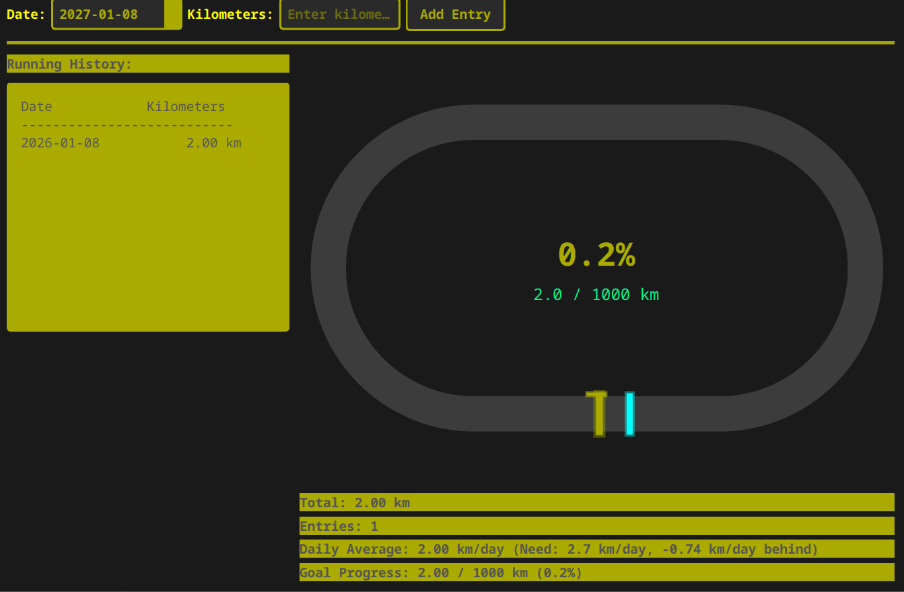

# Running Tracker

A C++ application with a Qt-based user interface.
Tracking daily running kilometers for a 1000km running challenge.



## Prerequisites

### Ubuntu/Debian
```bash
sudo apt-get update
sudo apt-get install build-essential cmake qtbase5-dev
```

### Fedora
```bash
sudo dnf install gcc-c++ cmake qt5-qtbase-devel
```

### Arch Linux
```bash
sudo pacman -S base-devel cmake qt5-base
```

## Building

```bash
# Create build directory
mkdir build
cd build

# Configure with CMake
cmake ..

# Build
make

# Run
./running_tracker
```


## License

MIT License
